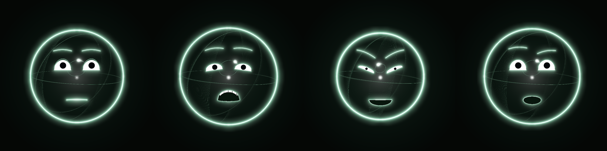

# claude-neonhead

A procedural talking head: three rotating rings, a neon contour, clipped
eyes with sclera and pupil, brows, a mouth with teeth, and a planet orbiting
in place of a nose. No 3D models — all geometry is generated in numpy every
frame.

The program opens a window and listens on a port. You send it JSON: emotions,
visemes, a volume level, or a ready-made timeline.



## Running

```bash
pip install -r requirements.txt
python run.py
```

`sounddevice` is only needed to hear the wav during `speak` — without it the
timeline still plays, just silently.

```bash
python run.py --config my.json      # your own config layered over the default
```

Keys in the window: `←`/`→` browse emotions one at a time (more emotions
than number keys, and digits would get in the way of typing over the same
terminal), `d` demo mode (cycles through every emotion), `y`/`n` nod/decline
gestures, `space` a test phrase, `c` reset, `esc` quit.

## Protocol

One JSON object per UDP datagram (port 9955), or one object per line over
TCP (port 9956). Order and delivery reliability don't matter — state is
always interpolated, no command can snap the face.

```jsonc
{"type": "emotion", "name": "anger", "weight": 1.0, "blend_ms": 250}
{"type": "viseme",  "shape": "D"}
{"type": "level",   "rms": 0.7, "f0": 0.3}
{"type": "say",     "text": "Hello, I'm here!"}
{"type": "speak",   "timeline": "timeline.json", "wav": "audio.wav"}
{"type": "set",     "params": {"eye_gaze_x": -0.8, "brow_y_l": 0.6}}
{"type": "clear"}
{"type": "demo",    "on": true, "hold_s": 2.0}
{"type": "gesture", "name": "yes"}
{"type": "config",  "patch": {"palette": {"contour": "#3FB8C8"}}}
{"type": "title",   "text": "neonhead: /home/me/project"}
{"type": "quit"}
```

Emotions: `neutral`, `interest`, `joy`, `anger`, `doubt`, `anxiety`, `sad`,
`fear`, `disgust`, `surprise`, `shame`, `dead`, `sleep`. Each is described in its own file in
`neonhead/emotions/` — a new file there is immediately picked up into the
emotion list and the demo cycle, with no edits elsewhere.

`demo` cycles through every emotion in `neonhead/emotions/`, `hold_s`
seconds each (2 by default), until a `demo` with `"on": false` arrives, any
other `emotion` command, or `clear`.

Gestures are short animations, not a static pose: `yes` (nod, 3 cycles) and
`no` (shake, 3 cycles), self-clearing on completion. They live in
`neonhead/gestures/`, the same way — a new file there is immediately
available by name.

Visemes: `X` silence, `A` m/b/p, `B` s/z/t/d/n/k/g/h/ts/ch/sh/shch/y/i,
`C` e, `D` a, `E` o, `F` u, `G` f/v, `H` l/r.

### From the shell

```bash
python client.py emotion anger
python client.py say "hello, can you hear me"
python client.py level 0.8 0.3
python client.py set eye_gaze_x=-0.9 brow_y_l=0.7
python client.py config palette.contour=#3FB8C8 brightness.contour=4.5
python client.py demo 2.0
python client.py gesture yes
```

## Claude Code hooks

`.claude/skills/neonhead-react/` bundles a `neonhead-react` skill and a
`neonhead.sh` control script so Claude Code can react to you live, as a
face, without any python/venv in the loop.

1. Copy the example hooks config into place and reload:

   ```bash
   cp .claude/settings.example.json .claude/settings.local.json
   ```

   then run `/hooks` in Claude Code to pick it up.

2. That's it — the skill (`.claude/skills/neonhead-react/SKILL.md`) is
   already in the repo and picked up automatically; no separate install
   step. `neonhead.sh start`/`stop` run on `SessionStart`/`SessionEnd`, so
   the head opens and closes with the session on its own.

`settings.example.json` wires up one cue hook per session event
(`SessionStart`, `UserPromptSubmit`, `PermissionRequest`,
`PostToolUseFailure`, `Stop`, `SubagentStart`, `TaskCompleted`,
`Elicitation`), each firing a matching emotion or gesture via
`neonhead.sh` — e.g. `doubt` on a permission prompt, `anger` + `gesture no`
on a tool failure, `triumph` on a completed task. Every cue hook runs
`"async": true` so it never adds turn/session latency. The skill itself
additionally reacts to conversation *content* (jokes, typos, frustration,
etc. — see the trigger table in `SKILL.md`), on top of what the hooks
cover for raw session events.

You can drive `neonhead.sh` by hand the same way the hooks do:

```bash
.claude/skills/neonhead-react/neonhead.sh start
.claude/skills/neonhead-react/neonhead.sh emotion joy 0.6
.claude/skills/neonhead-react/neonhead.sh gesture yes
.claude/skills/neonhead-react/neonhead.sh stop
```
